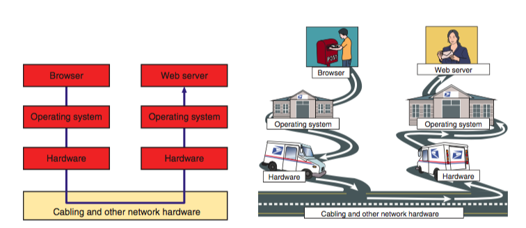
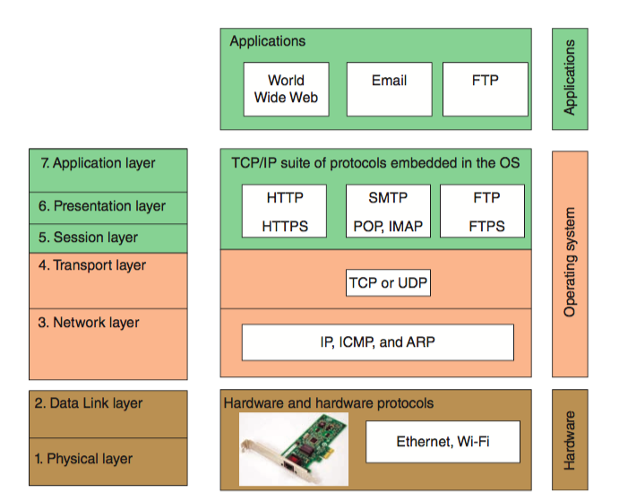

# CSCI 270 Fall 2019
# Lecture 1 08/22/2019
## Why should we learn this course?
1. Core courses of CS:
+ Computer Organization and Architecture
+ Data Structures and Algorithms
+ Operating Systems
+ Fundamentals of Compiling
+ **Computer Networks**
2. Waves of technologis
+ Search Engine
+ Big Data
+ Cloud Computing
+ AI
+ BlockChain

For the architecture of any big system, good **network** -> half done.
**Computer Networks** is foundation of many new technologies.

# Chapter 1: Introduction Networking

## Objectives
+ client-server vs. peer-to-peer networks
+ types of applications and protocols
+ hardware devices and physical topologies
+ seven-layer OSI model
+ safety and trouble-shooting

# Q: What is a network?
## network
  + hardware devices
  + topologies
  + protocols 

## hardware devices
For example?

## topologies
+ physical topologies (hardware)
Devices fit together to form a network.
+ logical topologies (software: operating system)
   + peer-to-peer(P2P)
  OS of each computer controls its own adiministrations, resources and security without a centralized control. The computers are also connected directely.
  
    - advantages:
    1. easy to set up
    2. not expensive
    - disadvantages:
    1. not scalable: not easy to add more devices to the network
    2. not practical for 15 computers
   + client-server
  controlled by NOS via a centralized directory database
  **domain**: computers/clients controlled by the server
  **AD(active directory)**: the centralized directory database
  **AD DS(domain service)**:: manages clients' getting accesss to server
  
     - advantage
      1. user account and password
      2. resources sharing
      3. problems are easy to fix
      4. more scalable
### applications vs. protocals
  + protocals are agreements.
  + applications follow protocals.
  
  #### Protocals: 
  A protocal consists of 
  1. syntax：  in some specific format.
  2. semantic: meaningful.
  3. sequence: in order.
  Only throught protocals, a group of computers can colaborate to complete a huge task.
  #### Examples
  1. Data transmission: TCP, UDP, IP
  2. Web service: HTTP, HTTPS (for both server and client)
  3. Email service: SMTP (for client), POP3, IMAP4 (for server)
  4. FTP service: FTP (client-server)
  5. Telnet/remote control service: telnet(client-server)
  6. ...
  **Protocals in OSI seven-layer model**
  
  
  
             
  #### Characteristics of protocals:
  1. too many to remember
  2. You feel you understand some protocal, but you can not explain it clearly.
  3. You do not know how to solve practical problems.
  #### Procedure of learning  protocals:
  1. You feel you know it once you learn it
  2. You feel overwhelmed when being asked questions
  3. You feel frustrated in real projects.
  
  #### How to learning Computer Networks/Protocals?
  1. use daily examples
  2. use CISCO Packet Tracer
  [CISCO Packet Tracer: download and training course](https://www.netacad.com/courses/packet-tracer)
  
  3. imagine you are "there"
  
# CSCI 270 Fall 2019
# Lecture 2 08/27/2019

  ## Network Hardware
  ### LANs(Local Area Network) and their hardware
  **local**: each node on the network can communicate with each other directly.
  
  
  #### topologies
  **ring topology**(legacy topology, barely used today)
  **star topology**
  
  **mesh topology** 
  
  **bus topology** 
  
  
  **hybrid topology** 
  
  #### hardware
  1. [Hub](https://en.wikipedia.org/wiki/Ethernet_hub) (legacy device)
  
    A hub receives signals from one node and repeast those signals to all other connected nodes in a broadcast way.
    (one to all)
  2. [Switch](https://en.wikipedia.org/wiki/Network_switch)
  
    (one to one)
  **compare hubs and switches in CISCO Packet Tracer**
  
  3. Network Port(where you plug your network cable)
  
  + on motherboard
    
    
    
  + on NIC(network interface card)
    
    
    
  4. Router
    a device that manages traffic between two or more networks and can find the best path.
   
  **switch/hub** vs. **router**
  
  + A switch/hub belongs to one LAN.
  
  + A router belongs to two or more LANs.
  
  
  
  ### WAN and MAN
  
  **WAN(wide area network)**: a group of LANs that spreads over a wide geographical area.
  
  **MAN(metropolitan area network)**: a group of LANs that spreads in the same geographical area.
  
  + WAN and MAN/CAN(campus area network) might be used interchangeably.
  + The internet is the largest WAN.
  + PAN(personal area network) is the smallest network, which is a network of your own devices.
  
  ## Seven-layer OSI(open system interconnection) Model
  ### why multiple layers?
  1. We need a program/application to trasmit data.
  2. The program is complicated.
  3. Every complicated program should have multiple layers, this is required by software engineering.
  
  #### without OSI layers
  
  
  #### OSI layers
  
  
  Q: How to understand this 7-layer OSI model?
  A: <li>A message/transmission is a buffer or a block of memory in some format.</li>
     2.Imagine you are some applicatiom/program to deal with this message. You can be on the PC, server, router or switch...
     3.Imagine you have multple ports, you get the message from one port and send it through another.
     
  
       
    
  
  
    
  
  
  

      
  
  

