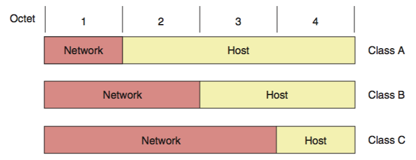
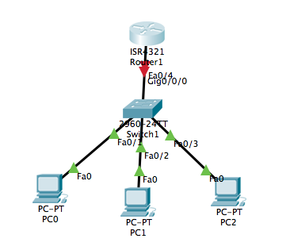
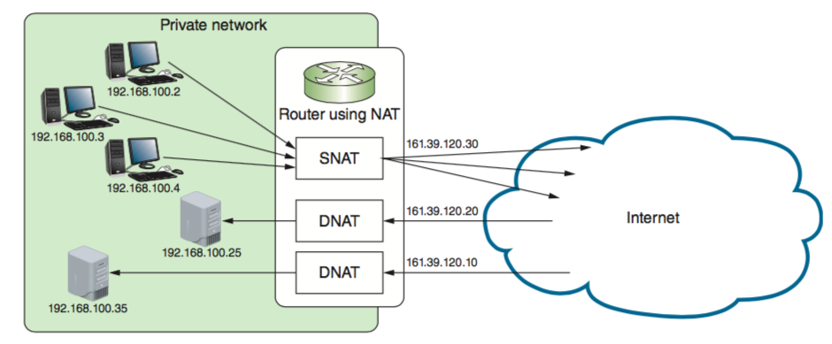
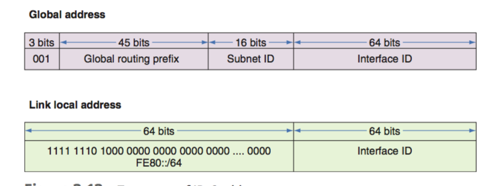
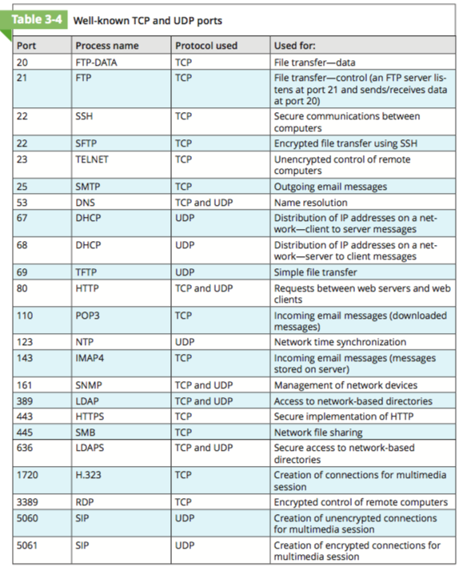
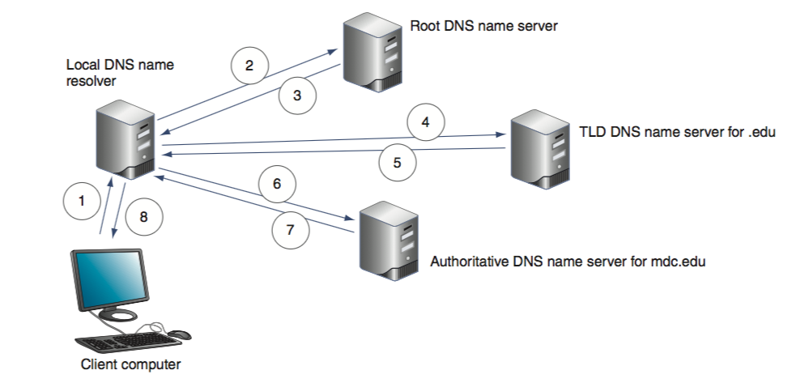

# CSCI 270 
# Chapter 3: Addressing on Networks
## Objectives:
+ MAC address
+ TCP/IP
  - IP address
  - subnet mask
  - default gateway
  - DNS server
+ port and socket
+ domain names and name resolution process
+ command-lines tools for trouble-shooting
# Lecture 3 08/29/2019
## 4 addressing methods to locate the host/node on a network
+ **MAC address**
  - on data link layer
  - uniq for every NIC
  - 48 bits (00:60:8C:00:53:99)
  - used for nodes to find each other on a LAN
+ **IP** address
  - on network layer
  - assigned to nearly every **interface**(network connection made by a node)
  - used for routing
  - two types:
    + IPv4 (internet protocal version 4)
      - 32 bits, 4 decimal numbers called octets (192.168.0.1)
    + IPv6
      - 128 bits, 8 hexadecimal numbers (2001.0D88:0B80:0000:000000D3:9C5A:00CC)
+ **port** number
  - on transport layer
  - to find application
+ **FQDNs**: fully qualified domain name
  - on application layer
  - host name + domain name
  - for example `www.google.com` has a host name `www` and a domain name `google.com`
  - `blackboard.sau.edu` has a host name `blackboard` and a domain name `blackboard`
## MAC address

+ 48 bits/ 6 bytes (for example 00:60:8C:00:54:99)
+ OUI(organizationally unique identifier): first 24 bits (00:60:8C) and assigned by [IEEE](http://standards.ieee.org/regauth/oui/index.shtml)

+ extension identifier/device ID: last 24 bits

## IP address
+ static IP address
+ dynamic IP address by **DHCP**(dynamic Host Configuration Protocal) server
+ gateway: A computer/router/other device that a host uses to access another network. The default getway is a getway device that nodes on the network turn to first for access to outside world.
+ subnet mask/net mask
  - 32 bits 
  - seperate host ID from network ID (IP address consists of 2 parts, host ID and network ID)
+ DNS server
  - responsible for tracking computer names and their IP addresses
+ You can use *ipconfig* utility in *Command Prompt* window  to find the current TCP/IP settings.

### IPv4
+ 32-bit/4 octets, the range of each octet (0,255)
+ the smallest IP 0.0.0.0, the laregest 255.255.255.255
+ the are totally 255*255*255*255 = 4.3 billion IPv4 addresses
+ IP = network ID(first 16 bits) + host ID(last 16 bits)
+ classful addression(5 classes: class A, class B, class C, class E, and class E)

|Class|Network octets|approximate number of networks|approximate num of IP addresses in each network|usage|
|----|----|----|----|---|
|A|1.x.y.z to 126.x.y.z|126|16 million|public|
|B|128.0.x.y to 191.255.x.y|16,000|65,000|public|
|C|192.0.0.x to 223.255.255.x|2 million|254|public|
|D|224.0.0.0 to 239.255.255.255|||multicast|
|E|240.0.0.0 to 254.255.255.255|||research|

|public IP address|private IP address|
|----|----|
|on the internet|on private network|
|class A,B,C|10.0.0.0 to 10.255.255.255 172.16.0.0 to 172.31.255.255 192.168.0.0 to 192.168.255.255|

**network portion and host porion for class A,B,C**

**reserved IP**

|IP address(es)|Function|
|----|----|
|255.255.255.255|broadcast,a broadcast message is read by every node on the network|
|0.0.0.0|currently unassigned|
|127.0.0.1 to 127.255.255.255|used for research or loopback address(your own computer IP)|
|169.254.0.1 to 169.254.255.254|used to create an APIPA address|

Note: APIPA(automatic private IP addressing) address is created when a computer configured for DHCP first connects to the network and is unable to lease an IPv4 address from the DHCP server

#### DHCP(dynamic host configuration protocal)
+ static IP addressing is usually unmanagable.
+ DHCP scope/ DHCP pool: a range of IP to be assigned to clients
  - a scope contains information of :
    + starting IP and ending IP
    + scope options:
      - a time limit, called a lease time
      - the default gateway's IP
      - the primary and secondary DNS server addresses
+ MAC/IP/DHCP reservation
  - DHCP server can recoganize the client by its MAC address and assign the same IP address.
  - reserved IP is not static IP, if you set a static IP, you need an IP exclusion on the DHCP server
+ Router can work as a DHCP server

#### Address translation: 
+ NAT(network address translation)
  - The number of public IP address is limited.
  - A gateway device substitues the privite IP used by a computer with its public IP, this process is called **address translation**
+ PAT(port address translation): each session between a local host and an Internet host will be assigned a seperate **port**.

+ 2 variations of NAT:
  - SNAT (static/source NAT): 
    + for outgoing message
    + all private IP addresses are tranlated into the same public IP
  - DNAT (destination NAT): 
    + for incoming message
    + each public IP is associated with a private IP.(a table should be created to store this information).

### IPv6
#### why?
  + allows for more public IP addresses
  + improves routing capabilities
  + improves the speed of communication
#### format
+ 128 bits (8 blocks/quartets, 16 bits for each block). exmaple: 2001:0000:0B80:0000:0000:00D3:9C5A:00CC
+ Leading zeros in one block (not blocks of all zeros) can be eliminated. 2001:0000:B80:0000:0000:D3:9C5A:CC
+ Blocks of all zeros can be elimated and replaced by double colons(::), but at most one set double colon is used.
  - 2001::B80:0000:0000:D3:9C5A:CC
  - 2001:0000:B80::D3:9C5A:CC (better because of less zeros)
#### new terminologies 
  - **link**/local link: any LAN bounded by routers
  - dual stacked: network with both IPv4 and IPv6
  - tunneling: transport IPV6 packets through/over an IPv4 network
  - interface ID: the last 64 bits or 4 blocks. Thest 64 bits identify an interface on the local link
  - Neigbors: two or more nodes on the same link.
#### Types of IPv6 addresses:
  - unicast address: specify a unique node on a network.
    + global address: similar to public IPv4 address, can be routed on the internet
    + link local address: used for communication with nodes in the same link
    
    
    
  - multicast address: deliver packets to all the nodes on all the targeted, multicast group
  - anycast address: identifies multiple destinations, with packets delivered to the closest one.
  
#### Autoconfiguration
  - without the help of DHCPv6 server.
  
## Ports and Sockets
+ port
  - is a number assigned to a process(a running application or server)
  - can receive data.
  - is used to identify process.
+ socket
  - consists of both host's IP and a processor's TCP/UDP port
  - format: **IP:port** for example 10.143.3.87:80
  - when the host receives a request for communication, it opens a **session**.
+ port numbers
  - range from 0 to 65535
  - 3 types
    + well-known ports: 
      - 0 to 1023
      
    + registered ports: 
      - 1024 to 49151
      - used temporarily for non-standard assignments for increased security
    + dynamic and private ports: 
      - 49152 to 65535
      - without restriction
 ## Domain names and DNS(domain name system)
 + Domain names(www.google.com etc) are convenient for human to remember.
 + For a FQDM(fully qualified domain name/host name + domain name), the last part (com for www.google.com) is called TLD(top-level domain)
 
 |TLD|type of organization|
 |----|----|
 |arpa|reserve look-up domain(special internet function)|
 |com|commercial|
 |edu|educational|
 |gov|government|
 |org|noncommercial organization|
 |net|network(such as ISP)|
 |mil|US military organization|
 |biz|business|
 |info|unrestricted use|
 
+ **DNS**
  - A computer needs DNS to convert FQDM to an IP.
  - DNS is an application layer client-server system, which consists of 
    + namespaces: databases of (name, ip)
      - stored on thousands of servers, not on a or serveral servers.
    + name servers: these servers contain namespace database
      - organizations who provide public host services(email.websites...) is responsible for DNS servers.
        + primary DNS server: contains DNS database associated with the organizatin
        + secondary DNS server: backup of primary DNS server
        + caching DNS server: cache the DNS info when it accesses public DNS data
        + forwarding  DNS server(optional): If it does not have the information a client needs, forward the request to another name server.
        
     
     
    + resolvers: the clients that request for DNS service
  
  
  
     + **Q: The name resolution of www.sau.edu** 
  
  - DNS server software: BIND(Berkeley Internet Name Domain)

 ## Command-line tools for troubleshooting
 ### ping(packet internet groper)
  - is used to verify that TCP/IP is installed, bound to NIC, configured correctly and communicating with the network.
  - uses ICMP(internet control message protocal)
  - sample ping commands
    + to verify you have the internet access: ping www.google.com (or other famous website)
    + to verify DNS is working: ping -a 8.8.8.8 (Google's public DNS servers)
    + to verify TCP/IP service is working: ping 127.0.0.1 or ping localhost
    + to verify if you can reach a specific IP: ping ip_address
 ### ipconfig (only for windows)
  - in Command Prompt window
  - to view and manage the TCP/IP settings
  - by now, you just need to know the simple `ipconfig` to show the summary of TCP/IP.
 ### ifconfig (for unix and linux)
  - in terminal
  - to view and manage the TCP/IP settings and renew DHCP configuration
  - by now, you just need to know the simple `ifconfig` to show the summary of TCP/IP.
 ### nslookup
  - query DNS database from any computer on the network
  - example: nslookup www.google.com

