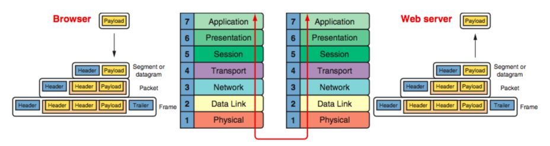
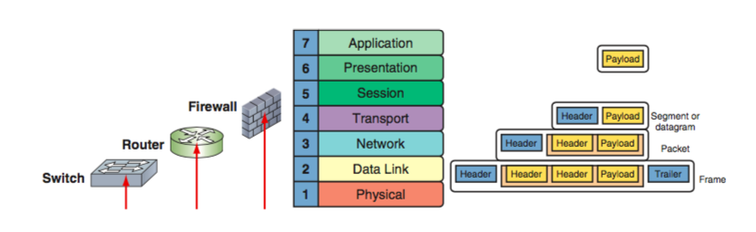
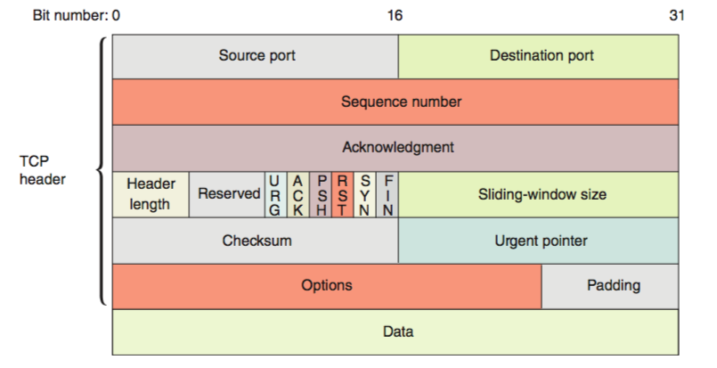
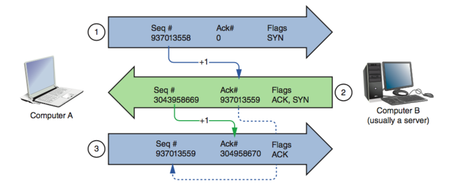
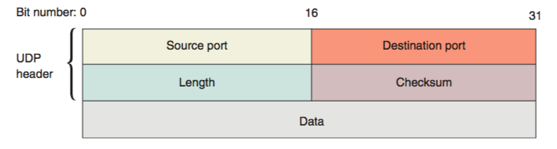

# Chapter 3 Network Protocols and Routing
## Objectvies
+ Describe the functions of core TCP/IP protocols
+ Identify how each protocol’s information is formatted in a TCP/IP message
+ Explain how routers manage internetwork communications
+ Employ various TCP/IP utilities for network discovery and troubleshooting

## TCP/IP core protocols
|||
|----|----|
|Layer 7|Application|
|Layer 6|Presentation|
|Layer 5|Session|
|Layer 4|**Transpot**|
|Layer 3|Network|
|Layer 2|Data Link|
|Layer 1|Physical|

+ TCP/IP is a suit of protocols.
+ Including TCP, IP, UDP, ARP...
+ 
  - sending host layer 7,6,5: original data generated by some application to create a **payload**
  - sending host layer 4: TCP/UDP adds a header to the payload to create a **segment/datagram**
  - sending host layer 3: IP adds a header to the segment/datagram to create a **packet**
  - sending host layer 2: NIC adds a header and a tailer to the packet to create a **frame**
  - sending host layer 1: places the actual trasmission on the network
  - receiving host: de-encapsulates the message
  

+ Connectivity devices are known by the highest OSI layer they read and process
  - switch: layer 2 (note: there exist layer 3 switches)
  - router: layer 3
  - firewall: layer4
  
  
  
### TCP(transmission contral protocol): a reliable delivery protocol
+ connection-oriented 
  - Before TCP transmits data, it ensures that a connection or session is established by a **three-way handshake**.
+ sequencing and checksums:
  - checksum:  Compare two checksum strings generated by sending and receiving host, if they fail to match, re-send the data
  - sequncing: sequencing numbers to reorder segments as they may not arrive in the order they are created.
+ flow control: the process of gauging the appropriate rate of transmission based on how quickly the recipient can accept data

#### TCP Three-Way Handshake

+ Step 1: SYN (Computer A: **I want to establish a connection.**)
  - seq#: random
  - ack#: 0
  - flags: SYN
+ Step 2: SYN/ACK (Computer B: **I agree.**)
  - seq#: random
  - ack#: seq#(in step 1) + 1
  - flags: SYN/ACK
+ step 3: ACK (Computer A: **The connection is established.**)
  - seq#: ack#in step 2)
  - ack#: seq#(in step 2) + 1
  - flag: ACK
+ **note that**:
  - no payload has beed included.
  - the random seq# is not real random.
  - the increment of seq# is 1 in the three-way handshake, the increment will be the length of the message after the connection is established.
### UPD(user datagram protocol): a unreliable, connectionless protocol
+ **unreliable**: UPD does not guarantee dilievery of data.
+ **connectionless**: no three-way handshake to establish a connection
+ no acknoledgment of transmission
+ no error checking
+ no sequencing
+ no flow control
+ ** more efficient**

## IP (internet protocol)

|----|----|
|Layer 7|Application|
|Layer 6|Presentation|
|Layer 5|Session|
|Layer 4|Transpot|
|Layer 3|**Network**|
|Layer 2|Data Link|
|Layer 1|Physical|

